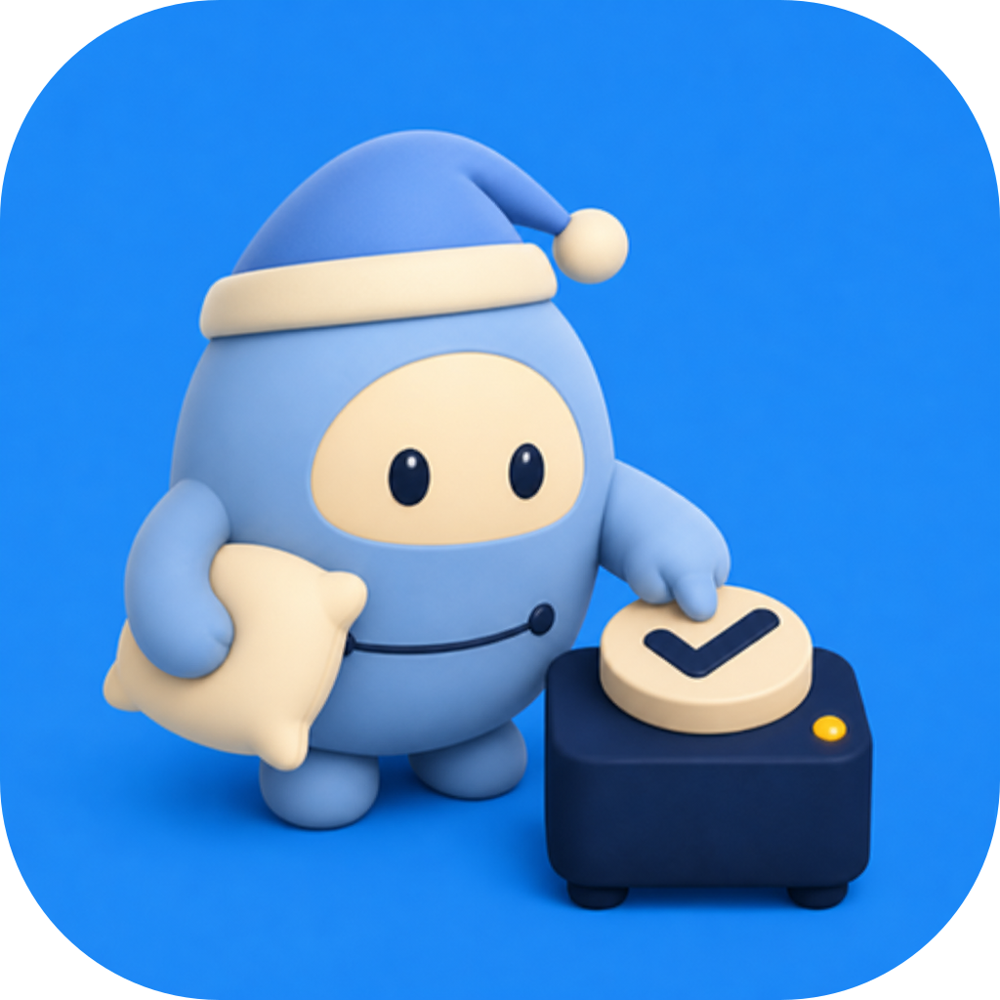
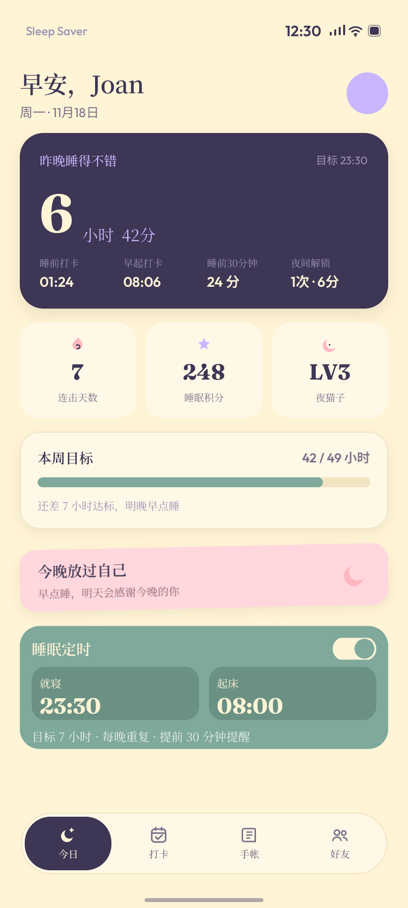
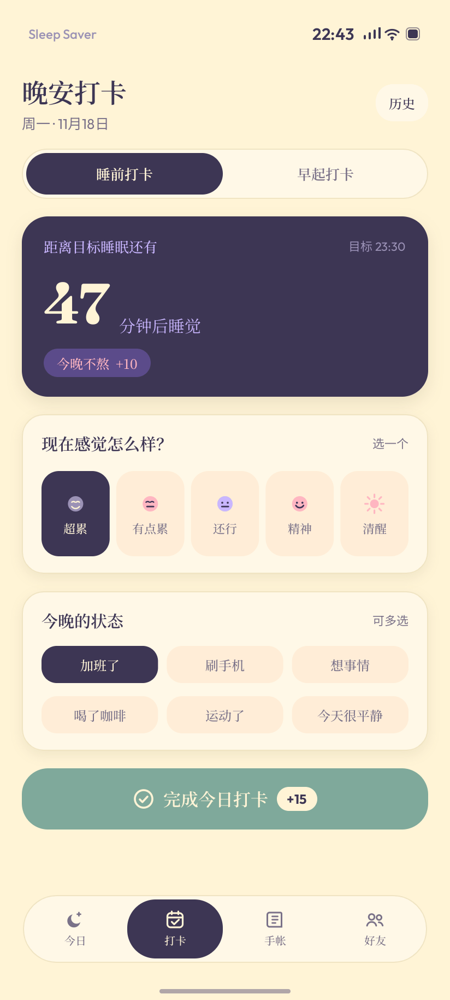
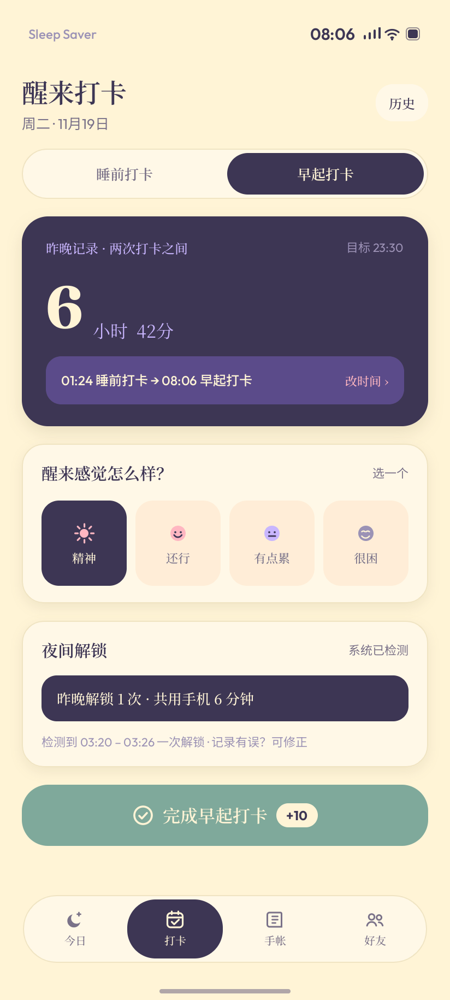
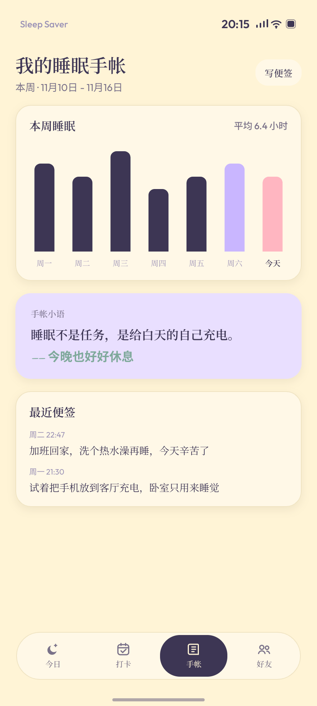

# 拯救睡眠 · Sleep Saver

<p align="center">
  
</p>

一款不依赖手环的 Android 睡眠打卡与作息管理工具。

它不假装测量深度睡眠，而是通过「睡前主动打卡 → 本地记录手机使用 → 早起主动打卡」形成轻量闭环，帮助用户逐渐建立规律作息。

> 当前版本：`1.2.2-dev`。这是正在验证中的个人项目，不是医疗设备，也不能代替专业睡眠诊断。

## 下载体验

前往 [GitHub Releases](https://github.com/jiahe140325-design/sleep-saver-android/releases/latest) 下载最新版 APK。

小米 / HyperOS 安装提示：

1. 下载文件名以 `.apk` 结尾的安装包。
2. 使用系统「文件管理」打开；如果出现增强防护提示，点击右上角菜单，选择「单次安装授权」。
3. 更新旧版本时直接覆盖安装，不要先卸载，否则本地记录可能被删除。

## 核心功能

- 睡前、早起双打卡，记录两次主动行为之间的休息窗口。
- 基于 Android 使用情况权限，统计睡前和夜间手机使用侧写。
- 睡眠定时与本地通知提醒。
- 每周数据、手帐便签与醒来感受记录。
- 数据导出与本地持久化。
- 好友入口暂时保留，当前显示「暂未开放」。

## 隐私原则

- 数据仅保存在设备本机的 Room / DataStore。
- 不接入 Supabase、腾讯云或其他外部数据库。
- V1 不声明 `INTERNET` 权限，不上传睡眠记录。
- 不申请定位、联系人、短信、电话、麦克风、相机或相册权限。
- 禁止 destructive migration，关闭 Android Auto Backup。

## 界面预览

<p>
  
  
  
  
</p>

## 质量与测试

- 17 项本地自动化逻辑测试全部通过。
- 测试场景覆盖通知亮屏、指纹解锁、跨零点、重复打卡、进程恢复、权限失效和提醒更新等情况。
- 自动化结果与小米 14 Pro 真机结果分开记录，不用模拟测试冒充真实设备验收。

详细结果见 [`docs/TEST_REPORT.md`](docs/TEST_REPORT.md)。

## 本地构建

需要：

- JDK 17
- Android SDK 36
- Android Build Tools 36

执行：

```bash
./gradlew testDebugUnitTest assembleDebug
```

成功标志：测试通过，并生成 `app/build/outputs/apk/debug/app-debug.apk`。

## 项目文档

- [`拯救睡眠-设计方案.md`](拯救睡眠-设计方案.md)：产品定位、双打卡闭环、数据口径、技术方案与测试场景。
- [`CHANGELOG.md`](CHANGELOG.md)：每次修改的版本、日期、内容与原因。
- [`docs/TEST_REPORT.md`](docs/TEST_REPORT.md)：自动化测试、APK校验值与真机验证边界。

## 使用与授权

当前仓库未添加开源许可证。代码和设计可公开查看，但不代表自动授权复制、再发布或商业使用。
