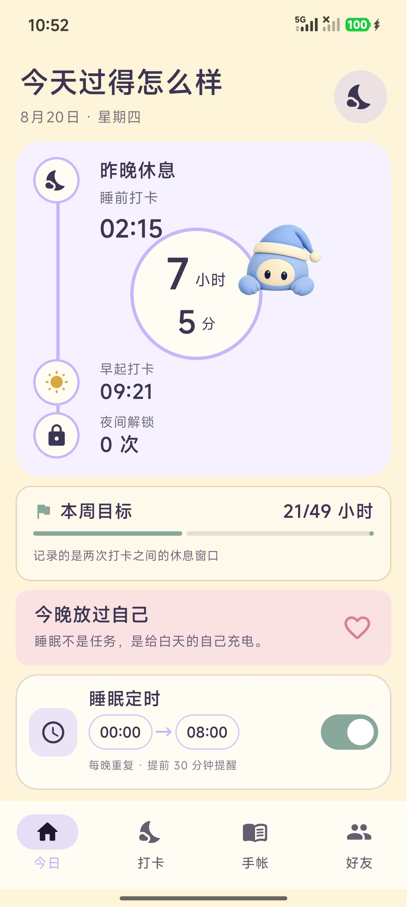
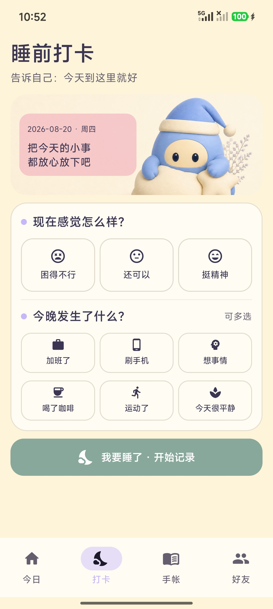
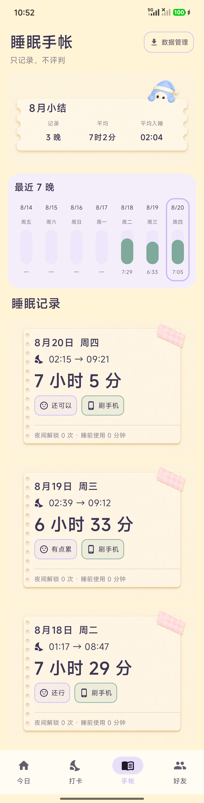
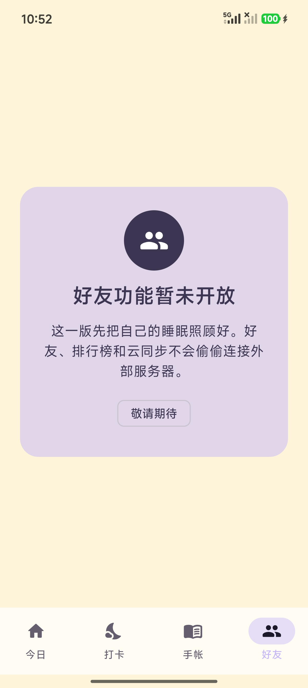
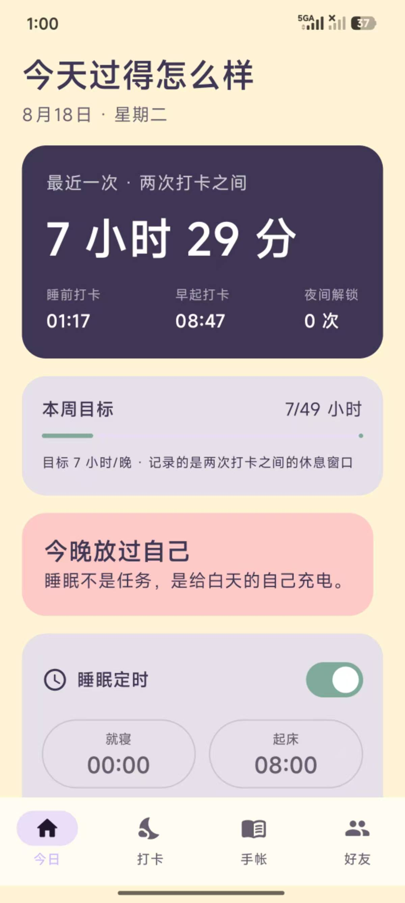
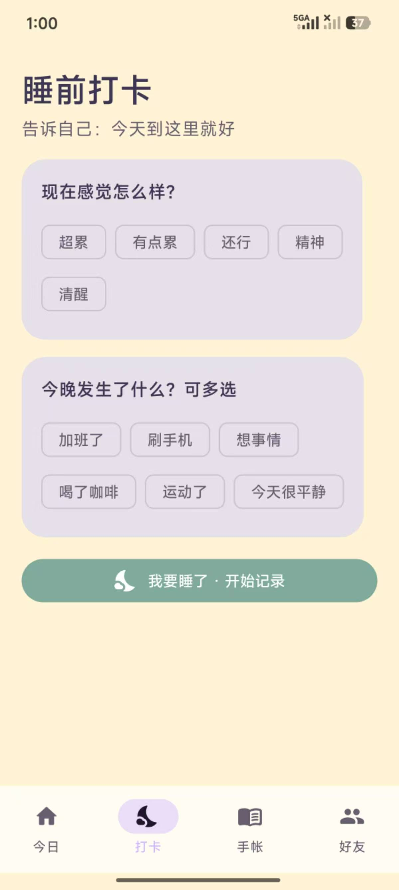
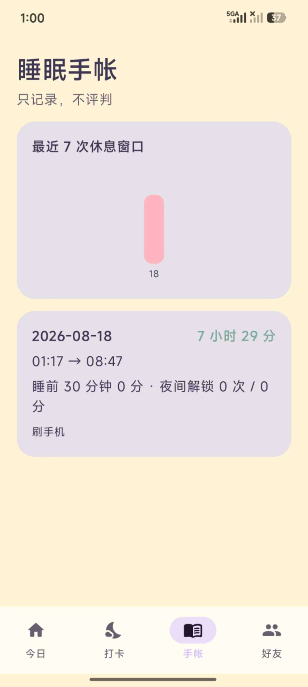
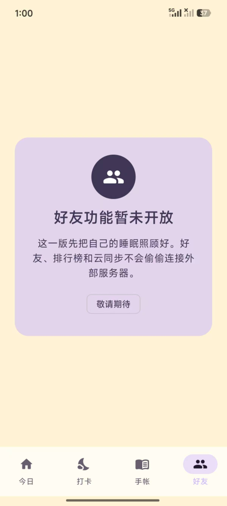
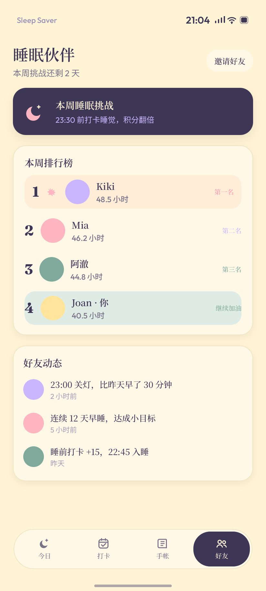

# 拯救睡眠 · Sleep Saver

<p align="center">
  
</p>

> 为了拯救睡眠，我给自己做了一个睡眠打卡 APP。🌙

## 为什么做它？

我不太喜欢戴着手环睡觉，但又很想知道：我昨晚到底几点放下了手机？半夜有没有突然醒来，又顺手刷了一会儿？

于是，我给自己做了「拯救睡眠」。它现在的核心逻辑其实很简单：

- 🌙 睡前，主动打卡一次；
- ☀️ 早起，再主动打卡一次；
- 📱 两次打卡之间，如果夜里真的解锁了手机，APP 就记录这次行为。

第二天打开它，我就能看看昨晚休息了多久、夜里有没有拿起手机，以及睡前是不是又没忍住多刷了一会儿。

它当然不能像手环一样测量心率、血氧或深度睡眠，更像是一本会帮我留意手机使用情况的睡眠手帐。对我这种不喜欢戴设备睡觉的人来说，已经足够帮助我发现一些以前没注意到的习惯了。

它当然还在继续长大：功能不算多，界面也已经改了好多版，甚至连 APP 图标都反复调整过，哈哈哈。但把生活里真实遇到的问题，慢慢做成一个自己愿意每天使用的小工具，这个过程本身就很值得记录。

接下来我会把它当作一个长期自我实验，看看连续使用 7 天、14 天、30 天后，它到底能不能让我更早放下手机、慢慢建立规律作息。

> **当前版本：`1.3.5-dev` · 支持 Android 10 及以上**<br>
> 今日页、打卡页和睡眠手帐已完成第一轮「小手帐」风格迭代。这是正在验证中的个人项目，不是医疗设备，也不能代替专业睡眠诊断。

[⬇️ 直接下载 Android APK](https://github.com/jiahe140325-design/sleep-saver-android/releases/download/v1.3.5-dev/SleepSaver-1.3.5-dev.apk) · [查看版本说明](https://github.com/jiahe140325-design/sleep-saver-android/releases/tag/v1.3.5-dev) · [查看完整更新记录](CHANGELOG.md)

### 这一版做了什么？

- 🕰️ 「今日」用一条时间线讲清昨晚从睡前打卡到早起打卡发生了什么。
- 📔 「打卡」改成小手帐：3 种状态、6 种睡前事件，记录过程不再只是干巴巴的文字按钮。
- 📊 「手帐」加入当月小结、最近 7 晚和纸张式历史记录，数据管理也移到了更容易找到的位置。
- 🔒 好友功能仍显示「暂未开放」；睡眠数据继续只保存在手机本地。

## 下载与安装

### 支持范围

- 支持 Android 10（API 29）及以上的标准安卓设备，不是小米专用 APP。
- 当前只在小米 14 Pro / HyperOS 上完成了实际安装验证。
- 其他品牌安卓手机原则上可以安装，但暂未逐一真机测试；不同厂商的安装授权、使用情况访问和后台提醒设置可能略有差异。

### 通用安卓安装步骤

1. 点击 [直接下载 `SleepSaver-1.3.5-dev.apk`](https://github.com/jiahe140325-design/sleep-saver-android/releases/download/v1.3.5-dev/SleepSaver-1.3.5-dev.apk)。如果直链没有开始下载，也可以前往 [版本发布页](https://github.com/jiahe140325-design/sleep-saver-android/releases/tag/v1.3.5-dev)，展开 `Assets` 后选择同名 APK。不要下载 `Source code` 压缩包。
   - 成功标志：下载后的文件名以 `.apk` 结尾。
2. 在系统通知栏或「文件管理」的下载目录中点击 APK。如果系统询问是否允许当前应用安装未知来源应用，按照提示临时允许。
   - 成功标志：进入显示「拯救睡眠」名称和图标的系统安装页面。
3. 点击「安装」，等待系统完成处理。
   - 成功标志：页面显示「应用已安装」，并且桌面出现「拯救睡眠」图标。
4. 如果是在更新旧版本，请直接覆盖安装，不要先卸载。
   - 成功标志：打开新版后，原有本地睡眠记录仍然存在。

### 小米 / HyperOS 特别提示

- 如果出现「增强防护」提示，点击安装页面右上角菜单，选择「单次安装授权」，再继续安装。
- 如果微信把文件保存成类似 `SleepSaver-1.3.5-dev.apk.2`，请先在系统「文件管理」中将末尾的 `.2` 删除，确保文件名以 `.apk` 结尾后再打开。

## 核心功能

- 睡前、早起双打卡，记录两次主动行为之间的休息窗口。
- 基于 Android 使用情况权限，统计睡前和夜间手机使用侧写。
- 睡眠定时与本地通知提醒。
- 3 种状态与 6 种睡前事件组成的小手帐式打卡。
- 今日睡眠时间线与本周休息目标。
- 当月小结、最近 7 晚趋势和纸张式历史记录。
- JSON / CSV 数据导出与本地持久化。
- 好友入口暂时保留，当前显示「暂未开放」。

## 隐私原则

- 数据仅保存在设备本机的 Room / DataStore。
- 不接入 Supabase、腾讯云或其他外部数据库。
- V1 不声明 `INTERNET` 权限，不上传睡眠记录。
- 不申请定位、联系人、短信、电话、麦克风、相机或相册权限。
- 禁止 destructive migration，关闭 Android Auto Backup。

## 界面与版本演变

### 当前实机界面 · `1.3.5-dev`

以下截图来自 `1.3.5-dev` 在小米 14 Pro / HyperOS 上的实际安装效果，拍摄于 2026 年 8 月 20 日。点击图片可以查看原始完整截图。

<p align="center">
  <a href="docs/screenshots/actual/v1.3.5/01-today-xiaomi14pro.jpg"></a>
  <a href="docs/screenshots/actual/v1.3.5/02-checkin-bedtime-xiaomi14pro.jpg"></a>
  <a href="docs/screenshots/actual/v1.3.5/03-journal-xiaomi14pro.jpg"></a>
  <a href="docs/screenshots/actual/v1.3.5/04-friends-xiaomi14pro.jpg"></a>
</p>

<p align="center"><sub>今日 · 睡前打卡 · 睡眠手帐（完整长截图）· 好友暂未开放</sub></p>

<details>
  <summary>查看 <code>1.2.2-dev</code> 早期实机截图</summary>

以下图片用于记录项目最初的安装效果，不代表当前界面。

<p>
  
  
  
  
</p>
</details>

## 原始设计参考

<details>
  <summary>展开查看早期设计稿</summary>

这些图片用于表达最初的信息架构和视觉方向，不是当前版本的安装截图，也不代表已经按像素级还原。

<p>
  
  
  
  
  
</p>
</details>

## 质量与测试

- 17 项本地自动化逻辑测试全部通过。
- 测试场景覆盖通知亮屏、指纹解锁、跨零点、重复打卡、进程恢复、权限失效和提醒更新等情况。
- 自动化结果与小米 14 Pro 真机结果分开记录，不用模拟测试冒充真实设备验收。

详细结果见 [`docs/TEST_REPORT.md`](docs/TEST_REPORT.md)。

## 本地构建

需要：

- JDK 17
- Android SDK 36
- Android Build Tools 36

执行：

```bash
./gradlew testDebugUnitTest assembleDebug
```

成功标志：测试通过，并生成 `app/build/outputs/apk/debug/app-debug.apk`。

## 项目文档

- [`拯救睡眠-设计方案.md`](拯救睡眠-设计方案.md)：产品定位、双打卡闭环、数据口径、技术方案与测试场景。
- [`CHANGELOG.md`](CHANGELOG.md)：每次修改的版本、日期、内容与原因。
- [`docs/TEST_REPORT.md`](docs/TEST_REPORT.md)：自动化测试、APK校验值与真机验证边界。

## 使用与授权

当前仓库未添加开源许可证。代码和设计可公开查看，但不代表自动授权复制、再发布或商业使用。
